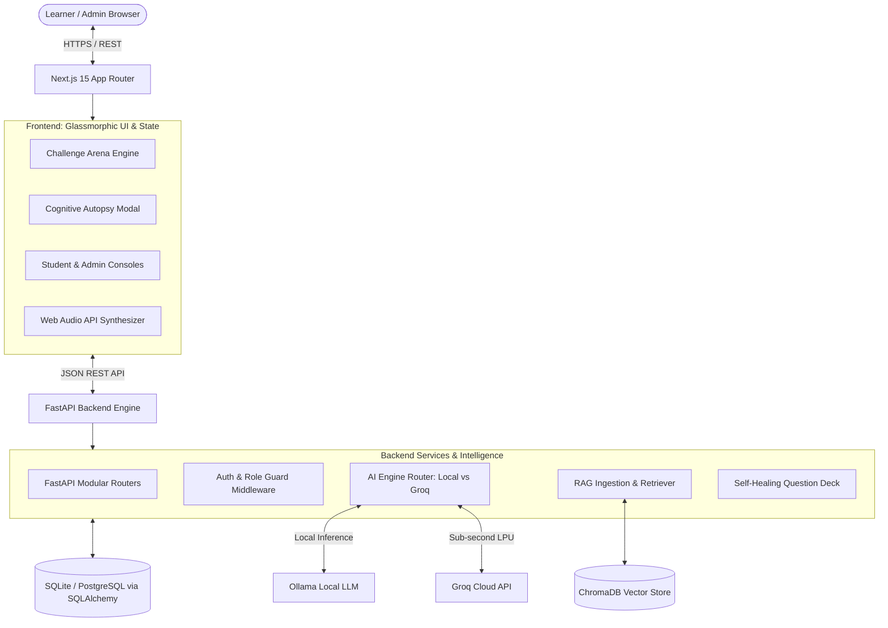

# 🧠 QuizGenius AI — Cognitive Autopsy Edition

<p align="center">
  
</p>

<p align="center">
  <strong>The intelligent academic quiz platform that doesn't just score answers — it diagnoses the exact mental misconception behind every mistake.</strong>
</p>

<p align="center">
  <a href="https://github.com/bhuvaneshwarann-ma/QuizGeniusAI/stargazers"></a>
  <a href="https://github.com/bhuvaneshwarann-ma/QuizGeniusAI/network/members"></a>
  <a href="https://github.com/bhuvaneshwarann-ma/QuizGeniusAI/blob/main/LICENSE"></a>
  <a href="https://fastapi.tiangolo.com/"></a>
  <a href="https://nextjs.org/"></a>
  <a href="https://groq.com/"></a>
  <a href="https://ollama.com/"></a>
</p>

---

## 📖 Table of Contents

- [The Core Innovation](#-the-core-innovation)
- [Key Differentiators](#-key-differentiators)
- [Key Features](#-key-features)
- [System Architecture](#-system-architecture)
- [Tech Stack](#-tech-stack)
- [Repository Structure](#-repository-structure)
- [Getting Started](#-getting-started)
  - [Prerequisites](#prerequisites)
  - [Backend Setup](#1-backend-setup)
  - [Frontend Setup](#2-frontend-setup)
  - [Database Seeding](#3-database-seeding)
- [Environment Configuration](#-environment-configuration)
- [API Endpoints Reference](#-api-endpoints-reference)
- [Running Automated Tests](#-running-automated-tests)
- [Contributing & Roadmap](#-roadmap--contributing)
- [License](#-license)

---

## 🔬 The Core Innovation

Most quiz platforms stop at a binary check: **Correct** or **Incorrect**. 

**QuizGenius AI** introduces **Cognitive Autopsy & Distractor Forensics**:
- Every distractor option is deliberately engineered around an established conceptual trap.
- When an incorrect answer is selected, the **Cognitive Autopsy Engine** names the exact misconception (e.g., *"Synchronous State Fallacy"*, *"Off-by-One Boundary Blindspot"*, *"Shallow Copy Illusion"*).
- Delivers an actionable **10-Second Mental Fix** so students immediately correct their mental model.
- Automatically adjusts question difficulty dynamically per concept tag rather than using a crude global score.

```
[Student Selection] ──► [Wrong Option: Distractor Trap Detected]
                               │
                               ▼
               ┌───────────────────────────────┐
               │    COGNITIVE AUTOPSY MODAL    │
               │ • Named Fallacy               │
               │ • Mental Model Diagnostic     │
               │ • 10-Second Targeted Cure     │
               └───────────────────────────────┘
```

---

## ⚡ Key Differentiators

| Feature | Standard Quiz Generators | QuizGenius AI |
| :--- | :--- | :--- |
| **Diagnostic Depth** | Generic "Wrong answer, the right answer is B" | Named cognitive misconception + mental model diagnostic |
| **Distractor Design** | Random or arbitrary incorrect options | Engineered cognitive pitfalls that reflect real student blindspots |
| **Material Ingestion** | Fixed pre-canned question banks | Zero-shot RAG ingestion of PDFs, slides, and raw notes |
| **AI Resilience** | App crashes or hangs if API limit is hit | Self-healing fallback engine with zero downtime |
| **LLM Flexibility** | Tied to a single cloud provider | Dual-engine: Local Ollama (offline) + Cloud Groq LPU (sub-second) |
| **Security & Auditing** | No role separation | Full RBAC (Admin / Student) with cryptographic tokens & audit logs |

---

## ✨ Key Features

### 1. 🛡️ Role-Based Access Control (RBAC)
- **Student Dashboard:** Access personalized quizzes, track concept mastery, inspect weak topics, and view study recommendations.
- **Admin Command Center:** Manage user roles, observe platform usage telemetry, view system audit logs, and configure LLM endpoints.

### 2. ⚡ Challenge Arena
- Gamified assessment mode featuring real-time countdown timers.
- Dynamic streak multiplier, sound synthesizers via the Web Audio API, and celebration confetti.
- Full keyboard navigation (`1`, `2`, `3`, `4` or `A`, `B`, `C`, `D` and `Enter`) for speed drills.

### 3. 📚 High-Precision RAG Document Pipeline
- Ingest course materials, lecture notes, and syllabus PDFs via `/materials/upload`.
- Automatic semantic chunking with overlap (`sentence-transformers/all-MiniLM-L6-v2`).
- Vector similarity search powered by **ChromaDB** to ground questions directly in your course material.

### 4. 🔄 Self-Healing Dual-AI Engine
- **Local Ollama** support (`llama3.2:3b` / `llama3`) for offline privacy.
- **Groq LPU Acceleration** (`llama-3.3-70b-versatile`) for ultra-low latency (<1s response).
- Automatic fallback mechanism: if an external model times out or errors, an offline deck is served seamlessly with zero demo interruptions.

### 5. 📇 Flashcards & Cognitive Study Guides
- Transform misunderstood concepts into active recall flashcards.
- Auto-generate structured study guides targeting diagnosed learning deficiencies.

---

## 🏗️ System Architecture



---

## 💻 Tech Stack

### Frontend
- **Framework:** [Next.js 15](https://nextjs.org/) (App Router, Server & Client Components)
- **UI & Styling:** Vanilla CSS + Tailwind CSS, Glassmorphic design system
- **Icons & Animations:** [Lucide React](https://lucide.dev/), Custom CSS micro-animations
- **Sound & Feedback:** Native HTML5 Web Audio API (zero external asset overhead), Canvas Confetti
- **Language:** TypeScript 5+

### Backend
- **Framework:** [FastAPI](https://fastapi.tiangolo.com/) (Asynchronous, Type-hinted)
- **Validation & Serialization:** [Pydantic v2](https://docs.pydantic.dev/)
- **Database ORM:** [SQLAlchemy 2.0](https://www.sqlalchemy.org/)
- **Security:** JWT (JSON Web Tokens), Passlib (bcrypt), SlowAPI rate limiting
- **Vector Search & RAG:** [ChromaDB](https://www.trychroma.com/), Sentence-Transformers, LangChain splitters
- **AI Providers:** [Groq Python SDK](https://github.com/groq/groq-python), Ollama API

---

## 📂 Repository Structure

```
QuizGeniusAI/
├── backend/
│   ├── data/
│   │   ├── fallback_questions.json      # Offline fallback question deck
│   │   └── seed.py                      # Database seeder (Admin & Demo users)
│   ├── middleware/
│   │   ├── auth_middleware.py           # JWT token validation
│   │   └── role_middleware.py           # Role-based access control (Admin / Student)
│   ├── models/
│   │   └── db_models.py                 # SQLAlchemy relational schemas
│   ├── rag/
│   │   ├── chunker.py                   # Semantic text chunking
│   │   ├── document_loader.py           # PDF, TXT, and Markdown parser
│   │   ├── embeddings.py                # Vector embeddings pipeline
│   │   ├── pipeline.py                  # End-to-end RAG orchestrator
│   │   └── vector_store.py              # ChromaDB client & collection manager
│   ├── routers/
│   │   ├── admin.py                     # Administrative telemetry & user management
│   │   ├── auth.py                      # Registration, login, token refresh
│   │   ├── autopsy.py                   # Cognitive Autopsy analysis endpoint
│   │   ├── materials.py                 # Document upload & knowledge ingestion
│   │   ├── quiz.py                      # Quiz generation & attempt submissions
│   │   ├── results.py                   # Historical exam reports
│   │   ├── student.py                   # Student profile & progress endpoints
│   │   └── study.py                     # Flashcard and study-guide generation
│   ├── services/
│   │   ├── ai/                          # AI abstraction layer (Groq + Ollama factory)
│   │   ├── audit_service.py             # System action logging
│   │   ├── auth_service.py              # Password hashing & JWT generation
│   │   ├── fallback_deck.py             # Self-healing fallback provider
│   │   └── document_service.py          # File extraction & processing
│   ├── config.py                        # Centralized application settings
│   ├── database.py                      # SQLAlchemy engine and session setup
│   ├── main.py                          # FastAPI application entrypoint
│   ├── requirements.txt                 # Backend Python dependencies
│   └── test_*.py                        # Integration & unit test suites
├── frontend/
│   ├── app/
│   │   ├── admin/                       # Admin Portal (users, stats, logs)
│   │   ├── arena/                       # Gamified Challenge Arena
│   │   ├── dashboard/                   # Main hub
│   │   ├── flashcards/                  # Spaced repetition flashcards
│   │   ├── login/                       # Authentication portal
│   │   ├── quizgenius/                  # Quiz creation interface
│   │   ├── student/                     # Student Portal (profile, announcements)
│   │   └── study-guide/                 # Cognitive study guide view
│   ├── components/
│   │   ├── AutopsyModal.tsx             # The signature cognitive misconception modal
│   │   ├── QuestionCard.tsx             # Interactive assessment card
│   │   ├── QChatDrawer.tsx              # AI Socratic tutor drawer
│   │   └── shared/                      # Navigation, Sidebar, ProtectedRoute wrappers
│   ├── lib/
│   │   ├── api.ts                       # Backend client wrapper with auth interceptors
│   │   ├── audio.ts                     # Synthesized sound effects (correct/wrong/fanfare)
│   │   └── auth.ts                      # Client-side session management
│   └── package.json                     # Frontend dependencies
├── design.md                            # Comprehensive UI/UX design specifications
├── spec.md                              # SDD (Spec-Driven Development) master blueprint
└── README.md                            # Project documentation
```

---

## 🚀 Getting Started

### Prerequisites
- **Python 3.10+**
- **Node.js 18+** & **npm**
- *(Optional)* [Ollama](https://ollama.com/) running locally (`ollama run llama3.2:3b`)
- *(Optional)* [Groq API Key](https://console.groq.com/) for lightning-fast cloud inference

---

### 1. Backend Setup

```bash
# Navigate to the backend directory
cd backend

# Create a virtual environment
python -m venv venv

# Activate the virtual environment
# Windows:
venv\Scripts\activate
# macOS/Linux:
source venv/bin/activate

# Install dependencies
pip install -r requirements.txt

# Create your environment file from the template
copy .env.example .env     # On Linux/macOS use: cp .env.example .env
```

*(Edit `.env` to insert your `GROQ_API_KEY` or configure local Ollama parameters if desired)*

```bash
# Start the FastAPI server
uvicorn backend.main:app --reload --host 0.0.0.0 --port 8000
```
API Documentation will be live at: **[http://localhost:8000/docs](http://localhost:8000/docs)**

---

### 2. Frontend Setup

```bash
# Open a new terminal and navigate to the frontend directory
cd frontend

# Install packages
npm install

# Start the Next.js development server
npm run dev
```
The web application will be accessible at: **[http://localhost:3000](http://localhost:3000)**

---

### 3. Database Seeding

To quickly populate the database with default accounts and sample data:

```bash
# Run the seed script from the root workspace
python -m backend.data.seed
```

#### Pre-configured Test Accounts:
| Role | Email | Password | Access Level |
| :--- | :--- | :--- | :--- |
| **Admin** | `admin@quizgenius.ai` | `Admin@12345` | Full administrative control, user management, audit logs |
| **Student** | `student@quizgenius.ai` | `Student@12345` | Student dashboard, adaptive arena, study guides |

---

## 🚀 Deployment Guide

QuizGenius AI is production-ready and configured for multiple deployment strategies:

### Option A: Vercel (Frontend) + Render / Railway (Backend) — *Recommended*

#### 1. Deploy the Backend (Render or Railway)
- **Render**: Create a new **Web Service**, connect your GitHub repo `bhuvaneshwarann-ma/QuizGeniusAI`.
  - **Runtime**: Python 3
  - **Build Command**: `pip install -r backend/requirements.txt`
  - **Start Command**: `uvicorn backend.main:app --host 0.0.0.0 --port $PORT`
  - **Environment Variables**:
    - `PYTHONPATH`: `.`
    - `LLM_PROVIDER`: `auto` (or `groq`)
    - `GROQ_API_KEY`: *(Your Groq API key)*
    - `ALLOWED_ORIGINS`: `https://your-frontend.vercel.app`
- Copy your backend URL (e.g., `https://quizgenius-api.onrender.com`).

#### 2. Deploy the Frontend (Vercel)
- Go to [vercel.com](https://vercel.com/) and click **"Add New Project"**.
- Import `bhuvaneshwarann-ma/QuizGeniusAI`.
- Set **Root Directory** to `frontend`.
- Add **Environment Variable**:
  - `NEXT_PUBLIC_API_URL` = `https://quizgenius-api.onrender.com` (your deployed backend URL).
- Click **Deploy**.

---

### Option B: Render Blueprint (`render.yaml`) — *1-Click Deploy*
1. Push this repository to GitHub.
2. Go to **Render Dashboard** -> **Blueprints** -> **New Blueprint Instance**.
3. Select `QuizGeniusAI`. Render will automatically detect `render.yaml` and provision:
   - Python FastAPI web service with health checks
   - Next.js production service linked directly to the backend service.
4. Set your `GROQ_API_KEY` in the Render environment variables prompt.

---

### Option C: Docker & Docker Compose (Self-Hosted / VPS)

Deploy anywhere (DigitalOcean, AWS EC2, GCP, or local server) with a single command:

```bash
# Clone the repository
git clone https://github.com/bhuvaneshwarann-ma/QuizGeniusAI.git
cd QuizGeniusAI

# Spin up both frontend and backend
docker compose up --build -d
```
- Frontend: `http://<your-server-ip>:3000`
- Backend: `http://<your-server-ip>:8000`

---


## ⚙️ Environment Configuration

Configuration variables supported in `backend/.env`:

| Key | Default | Description |
| :--- | :--- | :--- |
| `LLM_PROVIDER` | `auto` | Inference engine: `auto` (tries Groq, falls back to Ollama/deck), `groq`, or `ollama` |
| `GROQ_API_KEY` | *empty* | Groq Cloud API key for ultra-fast LPU inference |
| `GROQ_MODEL` | `llama-3.3-70b-versatile` | Model used for question generation |
| `OLLAMA_BASE_URL` | `http://localhost:11434` | Ollama local instance URL |
| `OLLAMA_MODEL` | `llama3.2:3b` | Local LLM model identifier |
| `EMBEDDING_MODEL` | `sentence-transformers/all-MiniLM-L6-v2` | Embedding model for semantic search in RAG |
| `VECTOR_DB_PATH` | `./backend/data/chroma_db` | Persistent storage directory for ChromaDB embeddings |
| `SECRET_KEY` | *(Set strong key)* | Secret key used for signing JWT access tokens |
| `ALLOWED_ORIGINS` | `http://localhost:3000` | Allowed CORS origins |

---

## 📡 API Endpoints Reference

### Authentication & User Management
- `POST /auth/login` — Authenticate and receive JWT access token
- `POST /auth/register` — Register a new student account
- `GET /auth/me` — Retrieve the profile of the current authenticated user
- `POST /auth/refresh` — Refresh expired access tokens

### Core Quiz & Cognitive Autopsy
- `POST /api/generate` — Generate contextual questions from a topic or uploaded notes
- `POST /api/autopsy` — Analyze an incorrect answer and return a named fallacy with remediation
- `POST /api/attempt` — Record student answer attempt and calculate score adjustments

### Document Ingestion & RAG
- `POST /materials/upload` — Upload syllabus or PDF documents for chunking and vector indexing
- `GET /materials/list` — List all indexed study documents

### Learning & Remediation
- `GET /study/flashcards` — Generate active recall flashcards from problem areas
- `GET /study/guide` — Compile a targeted conceptual study guide

### Administration
- `GET /admin/stats` — Platform metrics (total users, quizzes taken, system health)
- `GET /admin/users` — List and manage user accounts
- `GET /admin/audit-logs` — Security and operation audit trails

---

## 🧪 Running Automated Tests

The repository includes comprehensive tests covering unit logic, document parsing, RAG pipeline integration, and role protection:

```bash
# Run all tests with pytest
pytest -v

# Run the complete Arena flow test
pytest backend/test_arena_flow_integration.py -v

# Run the RAG embedding & retrieval pipeline test
pytest backend/test_rag_pipeline.py -v

# Run document extraction and processing tests
pytest backend/test_document_service.py -v
```

---

## 🗺️ Roadmap & Contributing

- [x] Cognitive Autopsy Engine with named misconception diagnosis
- [x] Self-healing fallback mechanism for uninterrupted demos
- [x] Dual-LLM orchestration (Ollama + Groq)
- [x] RAG vector indexing with ChromaDB
- [ ] Multi-student synchronized Arena battles (WebSocket PvP)
- [ ] Socratic Voice Viva (speech-to-speech oral examination)
- [ ] Classroom concept heatmap for educators

Contributions, issues, and feature requests are welcome! Feel free to check the [issues page](https://github.com/bhuvaneshwarann-ma/QuizGeniusAI/issues).

---

## 📄 License

Distributed under the **MIT License**. See `LICENSE` for more information.

<p align="center">
  Built with 🧠 by <a href="https://github.com/bhuvaneshwarann-ma">Bhuvaneshwaran N</a>
</p>
