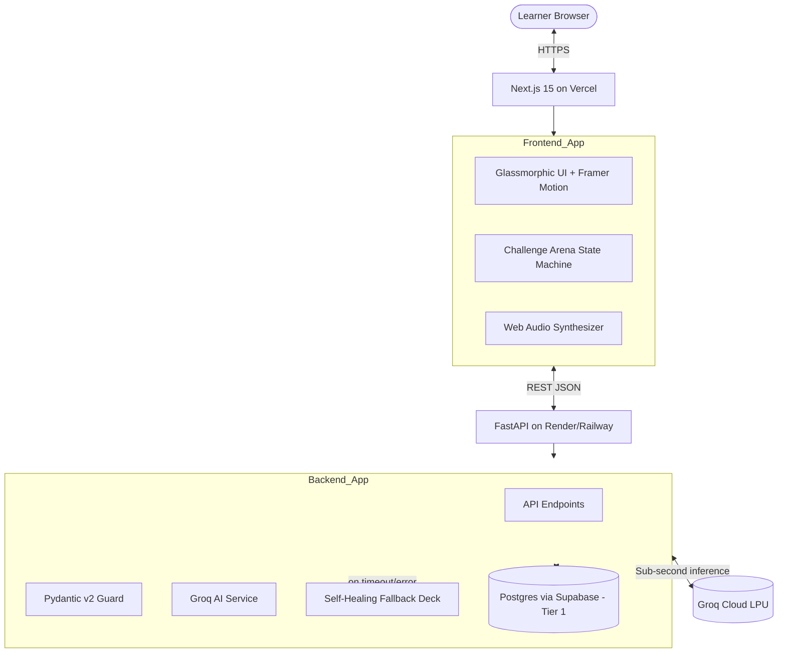

# SPEC.md: QuizGenius AI — Cognitive Autopsy Edition
**Spec-Driven Development (SDD) Master Specification**
**Version:** 6.0.0 — Merged Technical Spec + Hackathon Execution Blueprint
**Architecture:** Decoupled Hybrid — Groq LPU Inference + FastAPI Backend + Next.js 15 Frontend
**Time-Box Target:** 24-Hour Hackathon Build
**Scope Philosophy:** One defensible innovation, built flawlessly, beats five features built shakily. Every section below is scoped to what actually gets built (Tier 0 + optional Tier 1) — anything beyond that is explicitly labeled Roadmap, never implied as shipped.

---

## 1. The Product

**QuizGenius AI** generates a quiz from any topic or pasted material — and instead of marking answers just right or wrong, it **diagnoses the specific cognitive misconception behind every wrong answer**, names it, and gives a 10-second mental fix. It then quietly adapts difficulty per concept based on where the learner is actually struggling.

This is not "AI quiz generator #47." It's a **misconception-diagnosis engine** that happens to be delivered through a quiz format — a reframing that is both the product's core defensibility and the entire pitch.

**Tagline:** *The quiz that tells you why you got it wrong.*

---

## 2. Competitive Positioning

| Platform | Core Strength | Blind Spot | QuizGenius AI's Answer |
| :--- | :--- | :--- | :--- |
| Quizlet | Flashcards, spaced repetition | Static, crowd-sourced, rote | Fresh questions generated from any topic or your own notes, on demand |
| Kahoot / Quizizz | Real-time gamified multiplayer | Speed contest, zero conceptual depth | Diagnoses *why* an answer was wrong, not just that it was |
| Duolingo | Gamification, bite-sized UX | Rigid tree, no custom material, no "why" | Custom topic ingestion + explicit misconception naming |
| Brilliant.org | First-principles intuition | Expensive, static, no custom upload | Same diagnostic depth, generated instantly from your own material |
| LeetCode | Sandboxed code tests | No conceptual/architectural reasoning check | Targets conceptual misconceptions, not just syntax right/wrong |

### Unique Differentiators
1. **Named Cognitive Fallacies** — every wrong answer maps to a labeled misconception ("Synchronous State Fallacy," "Off-By-One Boundary Error"), not a generic "Incorrect."
2. **Zero-Shot Custom Ingestion** — paste your own notes/syllabus, get a quiz from *your* material in seconds.
3. **Self-Healing Fallback Engine** — if the AI API fails mid-demo, the app swaps to a pre-built deck invisibly. Most teams have a demo crash risk; this app is engineered not to visibly fail.
4. **Concept-Level Adaptive Difficulty** — per concept-tag, not global, so a learner strong in one area and weak in another gets targeted adjustment.
5. **Sub-second inference (Groq LPU)** — the diagnosis appears fast enough to feel conversational, not like a bolt-on AI feature.

---

## 3. Why This Wins a Hackathon

Judges score on innovation, technical depth, execution quality, demo impact, and real-world viability. This solution wins on all five without overreaching on any:
- **Innovation:** no major competitor diagnoses *why* an answer was wrong at the mental-model level.
- **Technical depth:** structured-output LLM generation, schema validation, a resilience layer most teams skip.
- **Execution quality:** one feature built to feel flawless beats five that half-work.
- **Demo impact:** the Autopsy modal is a repeatable, camera-friendly "wow" moment, triggerable on command.
- **Real-world viability:** a genuinely sellable ed-tech feature for test-prep companies, bootcamps, and corporate L&D.

---

## 4. Scope Tiers

| Tier | What's Included | Priority |
| :--- | :--- | :--- |
| **Tier 0 — Core** | Topic/paste ingestion, Challenge Arena, keyboard nav, Cognitive Autopsy modal, if/else adaptive difficulty, audio + confetti feedback, self-healing fallback deck | **P0 — must ship; this alone is the demo** |
| **Tier 1 — Stretch** | Simulated (non-networked) AI opponent race, DB-backed "Weak Topics" summary screen, session persistence | **P1 — only if Tier 0 is confirmed solid** |
| **Roadmap (not built)** | Real networked PvP w/ HP bars, Socratic Voice Viva, full BKT/Concept-DAG/Elo, Instructor/Admin dashboard + class heatmap, code-bug-toggle & drag-order question types | **Named in pitch as vision, never implied as built** |

---

## 5. AI Features (WOW Factor)

| Feature | What Judges See | Why It Lands |
| :--- | :--- | :--- |
| **Cognitive Autopsy Modal** | Wrong answer → instant named fallacy + diagnosis + fix | Plan the whole pitch around triggering this live |
| **Distractor Forensics** | Every wrong option is a deliberately engineered misconception | Shows the AI *designed* the trap, not just generated text |
| **Custom Ingestion** | Paste unscripted real content live → instant relevant quiz | Proves it isn't a canned demo |
| **Adaptive Difficulty** | Difficulty visibly shifts after a miss (honestly labeled rule-based, not oversold as Bayesian) | Shows a feedback loop, not one-shot generation |

---

## 6. Tech Stack
- **AI:** Groq API — `llama-3.3-70b-versatile` (question generation), `llama-3.1-8b-instant` (real-time autopsy)
- **Backend:** FastAPI (Python 3.11+), Pydantic v2, Uvicorn, `AsyncGroq` SDK, Swagger docs at `/docs`
- **Frontend:** Next.js 15 (App Router), React 19, TypeScript, Tailwind CSS v4, Framer Motion
- **Database:** Supabase (managed Postgres, free tier) for Tier 1; in-memory session dicts are an acceptable substitute if time is short
- **Audio/Visual:** Web Audio API (synthesized, no assets), `canvas-confetti`, Lucide React icons
- **Hosting:** Vercel (frontend), Render or Railway (backend)

---

## 7. System Architecture



### Guaranteed Fallback Strategy
If the Groq call for `/api/generate` times out (>4s) or errors, the backend instantly returns a pre-built local JSON question deck covering 2–3 common technical topics. The frontend must never show an error state for this — the swap is invisible. Build and test this in Tier 0, not as an afterthought.

### Design Tokens
- Background: `#08090E` (deep obsidian)
- Card surface: `rgba(17, 19, 30, 0.75)` with `backdrop-filter: blur(16px)`
- Border: `rgba(255, 255, 255, 0.08)`

---

## 8. Database Schema

```sql
CREATE TABLE sessions (
    id UUID PRIMARY KEY DEFAULT gen_random_uuid(),
    created_at TIMESTAMPTZ DEFAULT now()
);

CREATE TABLE quizzes (
    id UUID PRIMARY KEY DEFAULT gen_random_uuid(),
    session_id UUID REFERENCES sessions(id),
    topic TEXT NOT NULL,
    title TEXT NOT NULL,
    created_at TIMESTAMPTZ DEFAULT now()
);

CREATE TABLE questions (
    id UUID PRIMARY KEY DEFAULT gen_random_uuid(),
    quiz_id UUID REFERENCES quizzes(id),
    prompt TEXT NOT NULL,
    difficulty SMALLINT CHECK (difficulty BETWEEN 1 AND 5),
    concept_tag TEXT NOT NULL,
    cognitive_trap_name TEXT NOT NULL,
    cognitive_trap_detail TEXT NOT NULL,
    hint TEXT,
    options JSONB NOT NULL  -- [{id, text, is_correct, trap_explanation}]
);

CREATE TABLE attempts (
    id UUID PRIMARY KEY DEFAULT gen_random_uuid(),
    question_id UUID REFERENCES questions(id),
    session_id UUID REFERENCES sessions(id),
    selected_option_id TEXT NOT NULL,
    is_correct BOOLEAN NOT NULL,
    answered_at TIMESTAMPTZ DEFAULT now()
);

-- Powers the Tier 1 "Weak Topics" summary screen
CREATE VIEW weak_topics AS
SELECT q.concept_tag, COUNT(*) AS miss_count
FROM attempts a
JOIN questions q ON a.question_id = q.id
WHERE a.is_correct = false
GROUP BY q.concept_tag
ORDER BY miss_count DESC;
```

---

## 9. Pydantic Schemas (`backend/schemas.py`)

```python
from pydantic import BaseModel, Field
from typing import List, Optional, Literal

class DistractorOption(BaseModel):
    id: Literal["A", "B", "C", "D"]
    text: str
    is_correct: bool
    trap_explanation: Optional[str] = None

class ChallengeQuestion(BaseModel):
    id: str
    type: Literal["MCQ"] = "MCQ"
    difficulty: int = Field(ge=1, le=5)
    prompt: str
    code_snippet: Optional[str] = None
    options: List[DistractorOption]
    cognitive_trap_name: str
    cognitive_trap_detail: str
    concept_tag: str
    hint: str

class GenerateQuizRequest(BaseModel):
    topic: str
    num_questions: int = Field(default=5, ge=3, le=10)
    context_text: Optional[str] = None

class ChallengeQuiz(BaseModel):
    id: str
    title: str
    topic: str
    questions: List[ChallengeQuestion]
    created_at: str

class AutopsyRequest(BaseModel):
    question_id: str
    selected_option_id: str
    question_prompt: str
    chosen_text: str
    correct_text: str
    cognitive_trap_name: str

class AutopsyResponse(BaseModel):
    fallacy_name: str
    mental_model_diagnostic: str
    ten_second_cure: str

class WeakTopicItem(BaseModel):  # Tier 1
    concept_tag: str
    miss_count: int
```

---

## 10. API Structure
- `GET /health` — liveness check
- `GET /docs` — Swagger UI
- `POST /api/session` — create anonymous session, returns `session_id`
- `POST /api/generate` — `{topic, context_text?, num_questions}` → `ChallengeQuiz` (Groq `llama-3.3-70b-versatile`, Pydantic-validated, fallback on failure)
- `POST /api/autopsy` — wrong-answer context → `AutopsyResponse` (Groq `llama-3.1-8b-instant`)
- `POST /api/attempt` — logs an answer (Tier 1, powers weak-topics)
- `GET /api/session/{id}/weak-topics` — *(Tier 1)* ranked concept misses for that session

---

## 11. Frontend + Backend Plan

**Backend (`/backend`)**
```
main.py
schemas.py
routers/quiz.py
routers/autopsy.py
routers/session.py
services/groq_service.py
services/fallback_deck.py
data/fallback_questions.json
requirements.txt
.env.example
```

**Frontend (`/frontend/app`)**
```
page.tsx                       # Topic/paste input screen
arena/page.tsx                 # Challenge Arena
components/QuestionCard.tsx
components/AutopsyModal.tsx
components/DifficultyIndicator.tsx
components/SummaryScreen.tsx   # Tier 1
lib/audio.ts
lib/api.ts
```

---

## 12. UI/UX Strategy
- **Theme:** deep obsidian background, glass cards with blur, thin light borders — premium, not templated.
- **Motion:** Framer Motion for card transitions; the Autopsy modal's spring-in reveal deserves extra polish time since it's the demo centerpiece.
- **Micro-interactions:** on-screen keyboard-shortcut hints so judges see the hotkeys actually work.
- **Sound design:** bright ascending arpeggio on correct, low dissonant tone on incorrect — keeps the demo alive even muted on a projector.
- **Typography:** confident display font for headings, clean mono font for code/concept tags.

---

## 13. Build Plan — 24-Hour Roadmap

```mermaid
gantt
    title QuizGenius AI: 24-Hour Execution
    dateFormat X
    axisFormat %H:%M
    section Setup
    Scope lock, scaffold, CORS               :0, 60
    section Backend AI Engine
    Groq generate + autopsy + fallback deck  :60, 240
    section Frontend Core
    Input screen, Arena, keyboard nav        :240, 420
    section Signature Feature
    Cognitive Autopsy modal (highest leverage hours) :420, 540
    Adaptive difficulty logic                :540, 600
    Audio synth + confetti + polish          :600, 660
    section Checkpoint
    Tier 0 must be fully working here        :660, 660
    section Rest
    Sleep / break block                      :660, 780
    section Stretch
    Tier 1 (only if Tier 0 solid)            :780, 900
    section Ship
    Deployment (Vercel + Render), live test  :900, 1020
    Bug bash                                 :1020, 1140
    Pitch deck + rehearsal (3x minimum)      :1140, 1230
    Final polish, README, backup demo video  :1230, 1290
    Buffer / rest before presenting          :1290, 1440
```



### Free Tools/Services Used
Groq API (free tier), Supabase (free Postgres + Auth), Vercel (free hosting), Render/Railway (free backend tier), `canvas-confetti` (MIT), Google Fonts, Lucide React.

### Deployment Notes
- Frontend → Vercel, auto-deploy from `main`.
- Backend → Render/Railway, `GROQ_API_KEY` as an environment secret, never hardcoded.
- CORS explicitly allowed for the deployed Vercel domain, not just localhost.
- Commit a `.env.example` so config requirements are visible without exposing real keys.

---

## 14. Verification & Smoke Test Matrix

| ID | Test | Acceptance Criteria |
| :--- | :--- | :--- |
| ST-01 | Swagger docs | `/docs` shows all endpoints |
| ST-02 | Question generation | `POST /api/generate` returns 5+ valid questions in <3s |
| ST-03 | Fallback path | Forced Groq timeout/error still returns a valid quiz, invisible to the user |
| ST-04 | Keyboard navigation | `1-4` select, `Enter` submits, `H` reveals hint |
| ST-05 | Cognitive Autopsy | Wrong answer triggers `/api/autopsy` and renders fallacy + diagnostic + cure |
| ST-06 | Adaptive difficulty | A miss measurably lowers the next question's difficulty on that concept_tag |
| ST-07 | Audio + confetti | Correct/incorrect trigger distinct sounds; streaks trigger confetti |
| ST-08 | Production build | `npm run build` and `uvicorn` start with zero errors |
| ST-09 (Tier 1) | Simulated opponent | Renders with no real network dependency |
| ST-10 (Tier 1) | Weak topics screen | Correctly ranks concept tags by miss count |

---

## 15. Judge-Focused Demo Strategy
- Open with the problem, not the tech: *"Every quiz app tells you you're wrong. None of them tell you why your brain got it wrong."*
- Trigger the Autopsy modal live, deliberately, by picking a wrong answer on cue.
- Show custom ingestion with something unscripted (e.g. a judge's own bio page) to prove it isn't canned.
- Mention the fallback engine explicitly — proves resilience thinking, not just a feature demo.
- Close by showing adaptive difficulty visibly shift after a miss.
- Have a recorded backup demo video ready in case of live Wi-Fi/API failure.

---

## 16. 2-Minute Winning Pitch

> "Every quiz app in the world tells you when you're wrong. None of them tell you *why* your brain got it wrong.
>
> QuizGenius AI fixes that. Paste any topic — or your own notes — and it generates a quiz in seconds. But when you make a mistake, instead of a red X, you get a **Cognitive Autopsy**: the AI names the exact misconception you fell into, explains it in one sentence, and gives you a 10-second fix.
>
> [Trigger the modal live here.]
>
> It runs on Groq's LPU inference for sub-second responses, with a self-healing fallback so it never visibly breaks mid-lesson — because a learning tool that fails during exam prep isn't a learning tool.
>
> This isn't a quiz app with AI bolted on. It's a misconception-diagnosis engine, and quizzing is just the delivery mechanism — a feature test-prep companies, bootcamps, and corporate L&D teams would pay for today."

---

## 17. Likely Judge Questions With Winning Answers

**Q: How is this different from just asking ChatGPT to explain a wrong answer?**
A: Distractors are engineered around named cognitive traps *before* generation, not diagnosed after the fact — the diagnosis is fast enough (Groq, sub-second) to stay in the flow of quizzing.

**Q: What happens if the AI hallucinates a wrong diagnosis?**
A: Schema-validated structured output (Pydantic) constrains every response shape, and the fallback deck guarantees a baseline experience if generation fails outright.

**Q: How does this scale / what's the business model?**
A: B2B licensing to bootcamps and corporate L&D for onboarding/certification prep, plus a freemium consumer tier for interview prep — the ingestion engine drives content cost toward zero, which is the actual moat versus static-content competitors.

**Q: What would you build next with more time?**
A: Real BKT-based mastery tracking, an instructor dashboard aggregating class-wide misconception patterns, and networked live PvP — deliberately deferred so the core diagnostic experience could be built well.

**Q: Is this really AI-native, or just a wrapper?**
A: The defensible IP is the cognitive-trap taxonomy and prompt design that makes distractors *diagnosable*, not the raw API call itself.

---

## 18. Pitch Deck (PPT) Structure
1. Title + tagline
2. The problem
3. The insight (misconception, not mistake)
4. Live demo / screenshot
5. How it works (simple architecture visual)
6. Differentiators table
7. Tech stack
8. Business angle (who pays, why)
9. Roadmap (explicitly future, not built)
10. Team + close

---

## 19. Technical Documentation Outline
- Architecture overview + diagram
- Setup instructions (env vars, install, run)
- API reference
- Data model
- Known limitations (stated upfront — honesty reads as credibility)
- Future roadmap section

---

## 20. README.md Structure
```
# QuizGenius AI
One-line tagline

## The Problem
## The Solution
## Demo (GIF or link)
## Features (Tier 0, clearly marked as built)
## Tech Stack
## Architecture Diagram
## Getting Started
## API Overview
## Roadmap (future work)
## Team
```

---

## 21. Resume-Ready Project Description

> Built QuizGenius AI, an AI-powered adaptive quiz engine that diagnoses learners' specific misconceptions (not just right/wrong answers) using LLM-generated distractor analysis; architected a FastAPI + Groq backend with schema-validated structured outputs and a self-healing fallback layer for zero-downtime demos, paired with a Next.js 15 frontend featuring real-time adaptive difficulty and synthesized audio feedback.

Short bullet version:
> AI quiz engine that diagnoses *why* an answer is wrong via LLM-generated cognitive-fallacy analysis (FastAPI, Groq, Next.js 15, Pydantic-validated structured generation, self-healing fallback system).

---

## 22. GitHub-Ready Folder Structure
```
quizgenius-ai/
├── backend/
│   ├── main.py
│   ├── schemas.py
│   ├── routers/
│   │   ├── quiz.py
│   │   ├── autopsy.py
│   │   └── session.py
│   ├── services/
│   │   ├── groq_service.py
│   │   └── fallback_deck.py
│   ├── data/
│   │   └── fallback_questions.json
│   ├── requirements.txt
│   └── .env.example
├── frontend/
│   ├── app/
│   │   ├── page.tsx
│   │   └── arena/page.tsx
│   ├── components/
│   ├── lib/
│   ├── package.json
│   └── .env.example
├── docs/
│   ├── ARCHITECTURE.md
│   └── API.md
├── README.md
└── .gitignore
```

---

## 23. The Complete Winning Execution Blueprint — Summary

**Idea →** One defensible innovation (Cognitive Autopsy), not five shallow ones.
**Architecture →** FastAPI + Groq + Next.js, schema-validated, with a fallback layer that doubles as a technical-depth talking point.
**Coding →** Tier 0 built to be flawless before a single line of Tier 1 is written; Tier 1 only with confirmed buffer time.
**Deployment →** Real deployed URL on Vercel + Render, tested live, backup video recorded as insurance.
**Presentation →** Pitch leads with the problem and the Autopsy moment, not the tech stack; unbuilt features are named as roadmap, never implied as shipped.
**Judging strategy →** Every judge question has a rehearsed, honest answer that turns a scope limitation into a deliberate engineering decision — "we cut this on purpose to ship the core well" beats "we tried to build everything and it's a bit broken," every time.

---
*End of SPEC.md — merged technical specification and hackathon execution blueprint, scoped for a realistic 24-hour build.*